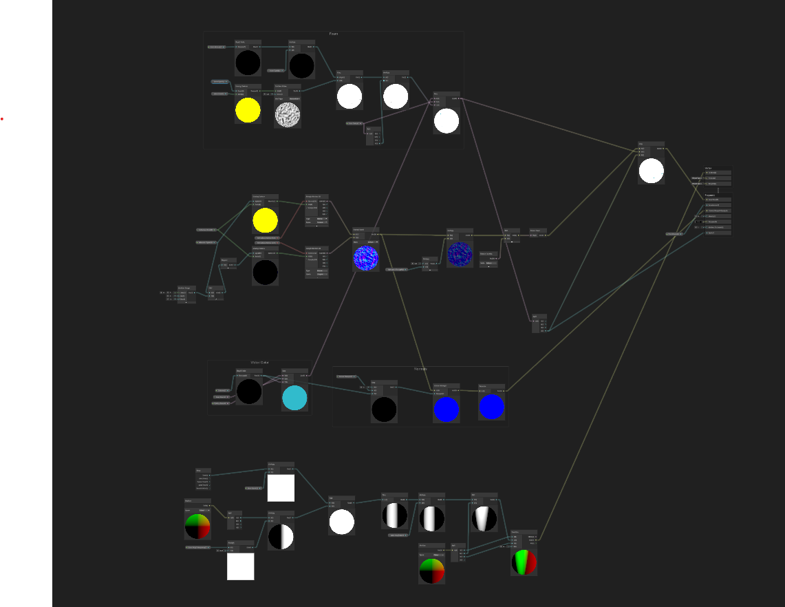

# Battleship

This is Battleship, a visualization project created for Dr. Chris Weaver's Computer Graphics class the University of Oklahoma.

## Structure

The main structure of this project follows any standard Unity project, but the most important files are found at the following locations
- Assets/Scripts - All of the scripts (mostly) pertaining to this project.
- Assets/Models - All of the raw 3D models exported from blender.
- Assets/Shaders - The shaders for this project, mainly used for the earth/water and written/created in Shader Graph. More on that below :)

## Planet Generation

The planet generation is handled using multiple layers of Fractal Noise. See the TerrainGeneration.cs script for more information about that.

## Water/Earth Shader

The earth shader is just a basic shader that takes in the color and outputs it onto the texture. The real magic happens in the Planet script where we take the planet height and get a value from 0 to 1 (ocean floor to highest point) and use that to step through a gradient that has various colors.  

The Water Shader, as visualized below, follows various papers on water rendering (unfortunately not saved, but any of the top results will result in a similar appearance with some adjustment). The main reason the water is able to look as decent as it does is because of two things: it is just a plane wrapped/mapped onto a sphere (hence the visual artifacts), and there is no physics besides a sphere collider provided by Unity. This allowed it to be much simpler in terms of calculating things like the vertices of the sphere, although those are also just a regular sphere as time did not permit for fancier waves and similar algorithms (that part of the shader graph was a work in progress, and is sort of shown on the bottom).  

